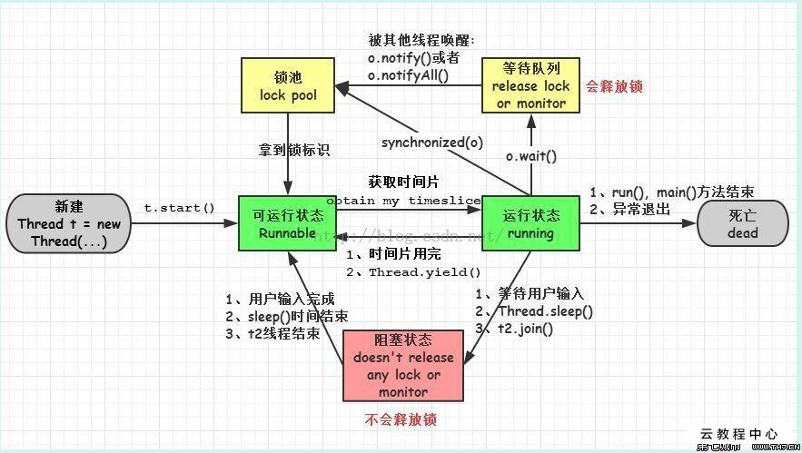

# Java 多线程并发

## 进程和线程
进程和线程的由来：
- 串行：初期的计算机智能串行执行任务，并且需要长时间等待用户输入
- 批处理：预先将用户的指令集中成清单，批量串行处理用户指令，仍然无法并发执行
- 进程：进程独占内存空间，保存各自运行状态，相互间不干扰且可以互相切换，为并发处理任务提供了可能
- 线程：共享进程的内存资源，相互间切换更快捷，支持更细粒度的任务控制，使进程内的子任务得以并发执行

### 进程和线程的区别
**进程是资源分配的最小单位，线程是 CPU 调度的最小单位**。
- 所有与进程相关的资源，都被记录在 PCB 中
- 进程是抢占处理机的调度单位；线程属于某个进程，共享其资源
- 线程只由堆栈寄存器、程序计数器和 TCB 组成

总结：
- 线程不能看作独立应用，而进程可看做独立应用
- 进程由独立的地址空间，相互不影响，线程只是进程的不同执行路径
- 线程没有独立的地址空间，多进程的程序比多线程程序健壮
- 进程的切换比线程的切换开销大

### Java 进程和线程的区别
- Java 对操作系统提供的功能进行封装，包括进程和线程
- 运行一个程序会产生一个进程，进程包含至少一个线程
- 每个进程对应一个 JVM 实例，多个线程共享 JVM 里的堆
- Java 采用单线程编程模型，程序会自动创建主线程
- 主线程可以创建子线程，原则上要后于子线程完成执行

```java
public class CurrentThreadDemo {
  public static void main(String[] args) {
    System.out.println("Current Thread: " + Thread.currentThread().getName());
  }
}
```
Current Thread: main

## Java 线程实现/创建方式

**Thread 中的 start 和 run 方法的区别**:
Thread#start()  ->   JVM_StartThread   ->    thread_entry   ->   Thread#run()
- 调用 start() 方法会创建一个新的子线程并启动
- run()方法只是 Thread 的一个普通方法的调用

### 继承 Thread 类
Thread 类本质上是实现了 Runnable 接口的一个实例，代表一个线程的实例。

启动线程的唯一方法就是通过 Thread 类的 start() 实例方法。

**start() 方法是一个 native 方法**，它将启动一个新线程，并执行 run() 方法。

```java
public class MyThread extends Thread {
  public void run() {
    System.out.println("MyThread.run()");
  }
}
MyThread myThread1 = new MyThread();
myThread1.start();
```

### 实现 Runnable 接口
如果自己的类已经 extends 另一个类，就无法直接 extends Thread，此时，可以实现一个 Runnable 接口。
```java
public class MyThread extends OtherClass implements Runnable {
  public void run() {
    System.out.println("MyThread.run()");
  }
}
// 因为 Runnable 接口没有 start() 这个方法，所以需要首先实例化一个 Thread，并传入自己的 MyRunnable 实例：
MyRunnable myRunnable = new MyRunnable();
Thread thread = new Thread(myRunnable);
thread.start();
// 事实上，当传入一个 Runnable target 参数给 Thread 后，Thread 的 run() 方法就会调用 target.run()
public void run() {
  if (target != null) {
    target.run();
  }
}
```

**Thread 和 Runnable 是什么关系**
- Thread 是实现了 Runnable 接口的类，使得 run 支持多线程
- 因类的单一继承原则，推荐多使用 Runnable 接口

**如何给 run() 方法传参**
实现的方式主要有三种：
- 构造函数传参
- 成员变量传参
- 回调函数传参

**如何实现处理线程的返回值**
实现的方式主要有三种：
- 主线程等待法
  - 优点：实现简单
  - 缺点：需要自己实现循环等待的逻辑，等待的变量如果很多，代码会显得异常臃肿；需要循环多久是不确定的，无法做到精准控制
- 使用 Thread 类的 join() 阻塞当前线程以等待子线程处理完毕
  - 优点：能做到比主线程等待法更精准的控制是，实现起来更简单
  - 缺点：粒度不够细   
- 使用 Callable 接口实现：通过 FutureTask 或线程池获取（JDK5 之后实现了多线程可以有返回值）

CycleWait.java
```java
public class CycleWait implements Runnable {
  private String value;
  public void run() {
    try {
      Thread.currentThread().sleep(5000);
    } catch {
      e.printStackTrace();
    }
    value = "we have data now";
  }
}

public static void main(String[] args) throws InterruptedException {
  CycleWait cw = new CycleWait();
  Thread t = new Thread(cw);
  t.start();
  // 1.
  while (cw.value == null) {
    Thread.currentThread().sleep(100);
  }
  // 2.
  t.join();
  System.out.println("value : " + cw.value);
}
```

MyCallable.java
```java
public class MyCallable implements Callable<String> {
  @Override
  public String call() throws Exception {
    String value = "test";
    System.out.println("Ready to work");
    Thread.currentThread().sleep(5000);
    System.out.println("task done");
    return value;
  }
}
```

FutureTaskDemo.java
```java
public class FutureTaskDemo {
  public static void main(String[] args) {
    FutureTask<String> task = new FutureTask<String>(new MyCallable);
    new Thread(task).start();
    if (!task.isDone()) {
      System.out.println("task has not finished, please wait!");
    } 
    System.out.println("task return: " + task.get());
  }
}
```

ThreadPoolDemo.java
```java
public class ThreadPoolDemo {
  public static void main(String[] args) {
    ExecutorService newCachedThreadPool = Executors.newCachedThreadPool();
    Future<String> future = newCachedThreadPool.submit(new Callable());
    if (!future.isDone()) {
      System.out.println("task has not finished, please wait!");
    }
    try {
      System.out.println(future.get());
    } catch (InterruptedException e) {
      e.printStackTrace();
    } catch (ExecutionException e) {
      e.printStackTrace();
    } finally {
      newCachedThreadPool.shutdown();
    }
  }
}
```

### Java 线程池
利用 Executors 创建不同的线程池满足不同场景的需求：
1. newFixedThreadPool(int nThreads)：指定工作线程数量的线程池
2. newCachedThreadPool()：处理大量短时间工作任务的线程池，
  2.1 试图缓存线程并重用，当无缓存线程可用时，就会创建新的工作线程；
  2.2 如果线程闲置的时间超过阈值，则会被终止并移出缓存；
  2.3 系统长时间闲置的时候，不会消耗什么资源
3. newSingleThreadExecutor()：创建唯一的工作者线程来执行任务，如果线程异常结束，会有另一个线程取代它
4. newSingleThreadScheduledExectutor() 与 newScheduledThreadPool(int corePoolSize)：定时或者周期性的工作调度，两者的区别在于单一工作线程还是多个线程
5. newWorkStealingPool()：内部会构建 ForkJoinPool，利用 working-stealing 算法，并行地处理任务，不保证处理顺序

Fork/Join 框架：
- 把大任务分割成若干个小任务并行执行，最终汇总每个小任务结果后得到大任务结果的框架

Work-Stealing 算法：某个线程从其他队列里窃取任务来执行

**为什么要使用线程池**：
- 降低资源消耗
- 提高线程的可管理性

**线程池的状态**：
- RUNNING：能接受新提交的任务，并且也能处理阻塞队列中的任务
- SHUTDOWN：不再接受新提交的任务，但可以处理存量任务
- STOP：不再接受新提交的任务，也不处理存量任务
- TIDYING：所有的任务都已终止
- TERMINATED：terminated()方法执行完后进入该状态

**线程池的大小如何选定**？
- CPU 密集型：线程数 = 按照核数或者核数 +1 设定
- I/O 密集型：线程数 = CPU 核数 * (1 + 平均等待时间/平均工作时间)

#### ThreadPoolExecutor
构造函数：
- corePoolSize：核心线程数量
- maximumPoolSize：线程不够用时能够创建的最大线程数
- workQueue：任务等待队列
- keepAliveTime：抢占的顺序不一定，看运气
- threadFactory：创建新线程，Executors.defaultThreadFactroy()

**handle：线程池的饱和策略**
- AbortPolicy：直接抛出异常，这是默认策略
- CallerRunsPolicy：用调用者所在的线程来执行任务
- DiscardOldestPolicy：丢弃队列中靠最前的任务，并执行当前任务
- DiscardPolicy：直接丢弃任务
- 实现 RejectedExecutionHandler 接口的自定义 handler

**新任务提交 execute 执行后的判断**：
- 如果运行的线程少于 corePoolSize，则创建新线程来处理任务，即使线程池中的其他线程是空闲的；
- 如果线程池中的线程数量大于等于 corePoolSize 且小于 maximumPoolSize，则只有当 workQueue 满时才创建新的线程去处理任务；
- 如果设置的 corePoolSize 和 maximumPoolSize 相同，则创建的线程池的大小是固定的，这时如果有新任务提交，若 workQueue 未满，则将请求放入 workQueue 中，等待有空闲的线程去从 workQueue 中取任务并处理；
- 如果允许的线程数量大于等于 maximumPoolSize，这时如果 workQueue 已经满了，则通过 handler 所指定的策略来处理任务

### 线程的状态
6 个状态：
- 新建（New）：创建后尚未启动的线程的状态
- 运行（Runnable）：包含 Running 和 Ready
- 无限期等待（Waiting）：不会分配 CPU 执行时间，需要显式被唤醒
  - 没有设置 Timeout 参数的 Object.wait() 方法
  - 没有设置 Timeout 参数的 Thread.join() 方法
  - LockSupport.park() 方法
- 限期等待（Time Waiting）：在一定时间后由系统自动唤醒
  - Thread.sleep()方法
  - 设置了 Timeout 参数的 Object.wait() 方法
  - 设置了 Timeout 参数的 Thread.join() 方法
  - LockSupport.parkNanos() 方法
  - LockSupport.parkUntil() 方法
- 阻塞（Blocked）：等待获取排他锁
- 结束（Terminated）：已终止线程的状态，线程已经结束执行

Thread.java
```java
public enum State {
  /**
   *  Thread state for a thread which has not yet started.
   */ 
   NEW,
   
 /**
  * Thread state for a runnable thread. A thread in the runnable state is executing in the JVM 
  * but it may be waiting for other resources from the operating system such as processor.
  */
  RUNNABLE,

  /**
   * Thread state for a thread blocked waiting for a monitor lock.
   * A thread in the blocked state is waiting for a monitor lock to enter a synchronized block/method after calling 
   * {@link Object#wait() Object.wait}.
   */
   BLOCKED,

   /**
    * Thread state for a waiting thread.
    * A thread is in the waiting state due to calling one of the following methods:
    * <ul>
    *   <li>{@link Object#wait() Object.wait()} with no timeout</li>
    *   <li>{@link #join() Thread.join} with no timeout</li>
    *   <li>{@link LockSupport#park() LockSupport.park}</li>
    * </ul>
    *
    * <p>A thread in the waiting state is waiting for another thread to perform a particular action.
    *
    * For example, a thread that has called {@code Object.wait()} on an object is waiting for another thread to call
    * {@code Object.notify()} or {@code Object.notifyAll()} on that object 
    * A thread that has called {@code Thread.join()} is waiting for a specified thread to terminate.
    */
    WAITING,

    /**
     * Thread state for a waiting thread with a specified waiting time.
     * A thread is in the timed waiting state due to calling one of the following methods 
     * with a specified positive waiting time:
     * <ul>
     *   <li>{@link #sleep Thread.sleep}</li>
     *   <li>{@link Object#wait(long) Object.wait()} with timeout</li>
     *   <li>{@link #join(long) Thread.join} with timeout</li>
     *   <li>{@link LockSupport#parkNanos() LockSupport.parkNanos}</li>
     *   <li>{@link LockSupport#parkUntil() LockSupport.parkUntil}</li>
     * </ul>
     */
     TIME_WAITING,

     /**
      * Thread state for a terminated thread.
      * The thread has completed execution.
      TERMINATED;
}
```

### sleep 和 wait 的区别
**基本的差别**：
- sleep 是 Thread 类的方法，wait 是 Object 类中定义的方法
- sleep() 方法可以在任何地方使用
- wait() 方法只能在 synchronized 方法或 synchronized 块中使用

Thread.java
```java
public static native void sleep(long millis) throws InterruptedException
```

Object.java
```java
public final void wait() throws InterruptedException {
  wait(0L);
}

public final native void wait(long timeoutMillis) throws InterruptedException;
```

**最主要的本质区别**：
- Thread.sleep 只会让出 CPU，不会导致锁行为的改变
- Object.wait 不仅让出 CPU，还会释放已经占有的同步资源锁

WaitSleepDemo.java
```java
public class WaitSleepDemo {
  public static void main(String[] args) {
    final Object lock = new Object();
    
    // 执行 wait 逻辑
    new Thread(new Runnable) {
      @Override
      public void run() {
        System.out.println("thread A is waiting to get lock");
        synchronized (lock) {
          try {
            System.out.println("thread A get lock");
            Thread.sleep(20);
            System.out.println("thread A do wait method);
            lock.wait(1000);
            System.out.println("thread A is done");
          } catch (InterruptedException e) {
            e.printStackTrace();
          }
        }
      }
    }).start();
    try {
      Thread.sleep(10);
    } catch (InterruptedException e) {
      e.printStackTrace();
    }
    
    // 执行 sleep 逻辑
    new Thread(new Runnable) {
      @Override
      public void run() {
        System.out.println("thread B is waiting to get lock");
        synchronized (lock) {
          try {
            System.out.println("thread B get lock");
            System.out.println("thread B is sleeping 10 ms");
            Thread.sleep(10);
            System.out.println("thread B is done");
          } catch (InterruptedException e) {
            e.printStackTrace();
          }
        }
      }
    }).start();
  }
}
```
- thread A is waiting to get lock 
- thread A get lock
- thread B is waiting to get lock 
- thread A do wait method 
- thread B get lock 
- thread B is sleeping 10 ms
- thread B is done
- thread A is done

如果顺序交换：
- thread A is waiting to get lock 
- thread A get lock
- thread B is waiting to get lock 
- thread A do wait method 
- thread A is done
- thread B get lock 
- thread B is sleeping 10 ms
- thread B is done

### notify 和 notifyAll 的区别 
- notifyAll 会让所有处于等待池的线程全部进入锁池去竞争获取锁的机会
- notify 只会随机选取一个处于等待池中的线程进入锁池去竞争获取锁的机会

#### 锁池（EntryList）
假设线程 A 已经拥有了某个对象（不是类）的锁，而其它线程 B、C 想要调用这个对象的某个 synchronized 方法（或者块），由于 B、C 线程在进入对象的 synchronized 方法（或者块）之前必须先获得该对象锁的拥有权，而恰巧该对象的锁目前正被线程 A 所占用，此时 B、C 线程就会被阻塞，进入一个地方去等待锁的释放，这个地方便是该对象的锁池。

#### 等待池（WaitSet）
假设线程 A 调用了某个对象的 wait()方法，线程 A 就会释放该对象的锁，同时线程 A 就进入到了该对象的等待池中，进入到等待池中的线程不会去竞争该对象的锁。

WaitSleepDemo.java
```java
public class WaitSleepDemo {
  public static void main(String[] args) {
    final Object lock = new Object();
    
    // 执行 wait 逻辑
    new Thread(new Runnable) {
      @Override
      public void run() {
        System.out.println("thread A is waiting to get lock");
        synchronized (lock) {
          try {
            System.out.println("thread A get lock");
            Thread.sleep(20);
            System.out.println("thread A do wait method);
            lock.wait();                              // 进入无限等待
            System.out.println("thread A is done");
          } catch (InterruptedException e) {
            e.printStackTrace();
          }
        }
      }
    }).start();
    try {
      Thread.sleep(10);
    } catch (InterruptedException e) {
      e.printStackTrace();
    }
    
    // 执行 sleep 逻辑
    new Thread(new Runnable) {
      @Override
      public void run() {
        System.out.println("thread B is waiting to get lock");
        synchronized (lock) {
          try {
            System.out.println("thread B get lock");
            System.out.println("thread B is sleeping 10 ms");
            Thread.sleep(10);
            System.out.println("thread B is done");
            lock.notify();                    // 唤醒线程 A
          } catch (InterruptedException e) {
            e.printStackTrace();
          }
        }
      }
    }).start();
  }
}
```

### yield
当调用 Thread.yield()函数时，会给线程调度器一个当前线程愿意让出 CPU 使用的暗示，但是线程调度器可能会忽略这个暗示。

Thread.java
```java
/**
  * A hint to the scheduler that the current thread is willing to yield its current use of processor.
  * The scheduler is free to ignore this hint.
  *
  * <p> Yield is a heurisitic attempt to improve relative progression between threads that would otherwise over-utilise a CPU.
  * Its use should be combined with detailed profiling and benchmarking to ensure that it actually has the desired effect.
  * 
  * <p> It is rarely appropriate to use this method. 
  * It may be useful for debugging or testing purposes, where it may help to reproduce bugs due to race conditions.
  * It may also be useful when designing concurrency control constructs such as the ones in the 
  * {@links java.util.concurrent.locks} package.
  */
  public static native void yield();
```

### 如何中断线程（Interrupt）
目前使用的方法：
- 调用 interrupt()，通知线程应该中断了
  - 如果线程处于被阻塞状态，那么线程将立即退出被阻塞状态，并抛出一个 InterruptedException 异常
  - 如果线程处于正常活动状态，那么会将该线程的中断标志设置为 true。被设置中断标志的线程将继续正常运行，不受影响。
- 需要被调用的线程配合中断
  - 在正常运行任务时，经常检查本线程的中断标志位，如果被设置了中断标志就自行停止线程。
  - 如果线程处于正常活动状态，那么会将该线程的中断标志设置为 true。被设置中断标志的线程将继续正常运行，不受影响。

已经被抛弃的方法：
- 通过调用 stop()方法停止线程
- 通过调用 suspend()和resume()方法

### 线程状态图


## Java 锁

### 乐观锁
乐观锁是一种乐观思想，即认为读多写少，遇到并发写的可能性低，每次去拿数据的时候都认为别人不会去修改，所以不会上锁，但是**在更新的时候会判断一下在此期间别人有没有去更新这个数据，采取在写时先读出当前版本号，然后加锁操作**（比较跟上一次的版本号，如果一样则更新），如果失败则要重复读-比较-写操作。

Java 中的乐观锁基本都是通过 CAS 操作实现的，CAS 是一种更新的原子操作，**比较当前值跟传入值是否一样，一样则更新，否则失败**。

### 悲观锁
悲观锁就是悲观思想，即认为写多，遇到并发写的可能性高，每次去拿数据的时候都认为别人会修改，所以每次在读写数据的时候都会上锁，这样别人想读写这个数据就会 block 直到拿到锁。Java 中的悲观锁就是 **Synchronized**，AQS 框架下的锁则是先尝试 CAS 乐观锁去获取锁，获取不到，才会转换为悲观锁，如 RetreenLock。

### 自旋锁与自适应自旋锁
**自旋锁**（Java6 后默认开启）
- 许多情况下，共享数据的锁定状态持续时间较短，切换线程不值得 
- 通过让线程执行忙循环等待锁的释放，不让出 CPU
- 缺点：若锁被其他线程长时间占用，会带来许多性能上的开销（可通过 PreBlockSpin 更改）

**自适应自旋锁**（Java6 开始引入）
- 自旋的次数不再固定
- 由前一次在同一个锁上的自旋时间及锁的拥有者的状态来决定

自旋锁原理非常简单，**如果持有锁的线程能在很短时间内释放锁资源，那么那些等待竞争锁的线程就不需要做内核态和用户态之间的切换进入阻塞挂起状态，它们只需要等一等（自旋），等持有锁的线程释放锁后即可立即获取锁，这样就避免用户线程和内核的切换的消耗**。

线程自旋是需要消耗 CPU 的，说白了就是让 CPU 在做无用功，如果一直获取不到锁，那线程也不能一直占用 CPU 自旋做无用功，所以需要设定一个自旋等待的最大时间。

如果持有锁的线程执行之间超过自旋等待的最大时间仍没有释放锁，就会导致其他争用锁的线程在最大等待时间内还是获取不到锁，这时争用线程会停止自旋进入阻塞状态。

#### 自旋锁的优缺点
自旋锁尽可能的减少线程的阻塞，这对于锁的竞争不激烈，且占用锁时间非常短的代码块来说性能有大幅度的提升，因为自旋的消耗会小于线程阻塞挂起再唤醒的操作的消耗，这些操作会导致线程发生两次上下文切换。

但是如果锁的竞争激烈，或者持有锁的线程需要长时间占用锁执行同步块，这时候就不适合使用自旋锁了，因为自旋锁在获取锁前一直都是占用 CPU 做无用功，同时有大量线程在竞争同一个锁，会导致获取锁的时间很长，线程自旋的消耗大于线程阻塞挂起操作的消耗，其他需要 CPU 的线程又不能获取到 CPU，造成 CPU 的浪费，所以这种情况下我们要关闭自旋锁。

#### 自旋锁时间阈值（JDK1.6 引入了适应性自旋锁）
JVM 对于自旋周期的选择，JDK1.5 这个限度是一定的，写死的；**在 1.6 引入了适应性自旋锁**，适应性自旋锁意味着自旋的时间不再是固定的了，而是**由前一次在同一个锁上的自旋时间以及锁的拥有者的状态来决定**，基本认为一个线程上下文切换的时间是最佳的一个时间，同时 JVM 还针对当前 CPU 的负荷情况做了较多的优化，如果平均负载小于 CPUs 则一直自旋，如果有超过（CPUs/2）个线程正在自旋，则后来线程直接阻塞，如果正在自旋的线程发现 owner 发生了变化则延迟自旋时间（自旋计数）或进入阻塞，如果 CPU 处于节电模式则停止自旋，自旋时间的最坏情况是 CPU 的存储延迟（CPU A 存储了一个数据，到 CPU B 得知这个数据直接的时间差），自旋时会适当放弃线程优先级之间的差异。

#### 自旋锁的开启
JDK1.6 中：-XX:+UseSpinning 开启

-XX:PreBlockSpin=10 为自旋次数

JDK1.7 后，去掉此参数，由 JVM 控制

### Synchronized 同步锁
synchronized 可以把任意一个非 null 的对象当做锁。**它属于独占式的悲观锁，同时属于可重入锁**。

线程安全问题的主要诱因：
- 存在共享数据（也称临界资源）
- 存在多条线程共同操作这些共享数据

解决问题的根本方法：
同一时刻有且只有一个线程在操作共享数据，其他线程必须等到该线程处理完数据后再对共享数据进行操作。

**互斥锁的特性**：
**互斥性**：即在同一时间只允许一个线程持有某个对象锁，通过这种特性来实现多线程的协调机制，这样在同一时间只有一个线程对需要同步的代码块（复合操作）进行访问。

互斥性也称为操作的原子性。        

**可见性**：必须确保在锁被释放之前，对共享变量所做的修改，对于随后获得该锁的另一个线程是可见的（即在获得锁时应获得最新共享变量的值），否则另一个线程可能是在本地缓存的某个副本上继续操作，从而引起不一致。

**synchronized 锁的不是代码，锁的都是对象**。

根据获取的锁的分类：获取对象锁和获取类锁

获取对象锁的两种用法：
1. 同步代码块（synchronized(this), synchronized（类实例对象）），锁是小括号（）中的实例对象。
2. 同步非静态方法（synchronized method），锁是当前对象的实例对象。

获取类锁的两种用法：
1. 同步代码块（synchronized（类.class）），锁是小括号（）中的类对象（Class 对象）。
2. 同步静态方法（synchronized static method），锁是当前对象的类对象（Class 对象）。

**对象锁和类锁的总结**:
1. 有线程访问对象的同步代码块时，另外的线程可以访问该对象的非同步代码块；
2. 若锁住的是同一个对象，一个线程在访问对象的同步代码块时，另一个访问对象的同步代码块的线程会被阻塞；
3. 若锁住的是同一个对象，一个线程在访问对象的同步方法时，另一个访问对象的同步方法的线程会被阻塞；
4. 若锁住的是同一个对象，一个线程在访问对象的同步代码块时，另一个访问对象的同步方法的线程会被阻塞，反之亦然；
5. 同一个类的不同对象的对象锁互不干扰；
6. 类锁由于是一种特殊的对象锁，因此表现和上述 1，2，3，4 一致，而由于一个类只有一把对象锁，所以同一个类的不同对象使用类锁将会是同步的；
7. 类锁和对象锁互不干扰。

#### synchronized 作用范围
1. 作用于方法时，锁住的是对象的实例（this）；
2. 当作用于静态方法时，锁住的是 class 实例，又因为 class 的相关数据存储在元空间，是全局共享的，因此静态方法锁相当于类的一个全局锁，会锁住所有调用该方法的线程；
3. synchronized 作用于一个对象实例时，锁住的是所有以该对象为锁的代码块。它有多个队列，当多个线程一起访问某个对象监视器的时候，对象监视器会将这些线程存储在不同的容器中。

#### synchronized 核心组件
1. Wait Set：调用 wait 方法被阻塞的那些线程被放置在这里；
2. Contention List：**竞争队列**，所有请求锁的线程首先被放在这个竞争队列中；
3. Entry List：Contention List 中那些**有资格成为候选资源的线程被移动到 Entry List 中**；
4. OnDeck：任意时刻，**最多只有一个线程正在竞争锁资源，该线程被称为 OnDeck**；
5. Owner：当前已经获取到锁资源的线程被称为 Owner；
6. !Owner：当前释放锁的线程。

#### synchronized 实现
1. JVM 每次从队列的尾部取出一个数据用于锁竞争候选者（OnDeck），但是并发情况下，ContentionList 会被大量的并发线程进行 CAS 访问，为了降低对尾部元素的竞争，JVM 会将一部分线程移动到 EntryList 中作为候选竞争线程。
2. Owner 线程会在 unlock 时，将 ContentionList 中的部分线程迁移到 EntryList 中，并指定 EntryList 中的某个线程为 OnDeck 线程（一般是最先进去的那个线程）。
3. Owner 线程并不直接把锁传递给 OnDeck 线程，而是把锁竞争的权利交给 OnDeck，OnDeck 需要重新竞争锁。这样虽然牺牲了一些公平性，但是能极大地提升系统的吞吐量，在 JVM 中，也把这种选择行为称之为“竞争切换”。
4. OnDeck 线程获取到锁资源后会变为 Owner 线程，而没有得到锁资源的仍然停留在 EntryList 中。如果 Owner 线程被 wait 方法阻塞，则转移到 WaitSet 队列中，直到某个时刻通过 notify 或者 notifyAll 唤醒，会重新进去 EntryList 中。
5. 处于 ContentionList、EntryList、WaitSet 中的线程都处于阻塞状态，该阻塞是由操作系统来完成的（Linux 内核下采用 pthread_mutex_lock 内核函数来实现）
6. **synchronized 是非公平锁**。synchronized 在线程进入 ContentionList时，**等待的线程会先尝试自旋获取锁，如果获取不到就进入 ContentionList**，这明显对于已经进入队列的线程是不公平的，还有一个不公平的事情就是自旋获取锁的线程还可能直接抢占 OnDeck 线程的锁资源。
7. 每个对象都有一个 monitor 对象，**加锁就是在竞争 monitor 对象**，代码块加锁是在前后分别加上 monitorenter 和 monitorexit 指令来实现的，方法加锁是通过一个标记位来判断的。
8. synchronized **是一个重量级操作，需要调用操作系统相关接口**，性能是低效的，有可能给线程加锁消耗的时间比有用操作消耗的时间更多。
9. Java1.6，synchronized 进行了很多的优化，有**自适应自旋锁、锁消除、锁粗化、轻量级锁及偏向锁**等，效率有了本质上的提高。在之后推出的 Java1.7 和 Java1.8 中，均对该关键字的实现机理做了优化。引入了**偏向锁和轻量级锁**。都是在对象头中有标记位，不需要经过操作系统加锁。
10. **锁可以从偏向锁升级到轻量级锁，再升级到重量级锁**。这种升级过程叫做锁膨胀。
11. JDK1.6 中默认是开启偏向锁和轻量级锁，可以通过 -XX:-UseBiasedLocking 来禁用偏向锁。

#### synchronized 底层实现原理
实现 synchronized 的基础
- Java 对象头
- Monitor

对象在内存中的布局：
- 对象头
- 实例数据
- 对齐填充

##### Java 对象头

**对象头的结构**：
| 虚拟机位数 | 头对象结构 | 说明 |
| --- | --- | --- | 
| 32/64 bit | Mark Word | 默认存储对象的 hashCode，分代年龄，锁类型，锁标志位等信息 |
| 32/64 bit | Class Metadata Address | 类型指针指向对象的类元数据，JVM 通过这个指针确定该对象是哪个类的数据 |

**Mark Word**：
锁状态：
- 无锁状态（01）：对象 hashcode、对象分代年龄
- 轻量级锁（00）：指向锁记录的指针
- 重量级锁（10）：指向重量级锁的指针
- GC 标志（11）：空，不需要记录信息
- 偏向锁（01）：线程 ID、Epoch、对象分代年龄、是否是偏向锁（1）

##### Monitor 
每个 Java 对象天生自带了一把看不见的锁

Monitor 锁的竞争、获取与释放

**重入**：
从互斥锁的设计上来说，当一个线程试图操作一个由其他线程持有的对象锁的临界资源时，将会处于阻塞状态，但当一个线程再次请求自己持有对象锁的临界资源时，这种情况属于重入。

**早期 synchronized 的缺点**：
- 早期版本中，synchronized 属于重量级锁，依赖于 Mutex Lock 实现
- 线程之间的切换需要从用户态转换到核心态，开销较大

Java6 以后，synchronized性能得到了很大的提升：
- 自适应（Adaptive Spinning）
- 锁消除（Lock Eliminate）
- 锁粗化（Lock Coarsening）
- 轻量级锁（Lightweight Locking）
- 偏向锁（Biased Locking）

**锁消除**
更彻底的优化：
- JIT 编译时，对运行上下文进行扫描，去除不可能存在竞争的锁

StringBuffeWithoutSync.java
```java
public class StringBuffeWithoutSync {
  public void add(String str1, String str2) {
    // StringBuffer 是线程安全的，由于 sb 只会在 append 方法中使用，不可能被其他线程引用
    // 因此 sb 属于不可能共享的资源，JVM 会自动消除内部的锁
    StringBuffer sb = new StringBuffer();
    sb.append(str1).append(str2);
  }
}
```

StringBuffer.java
```java
public synchronized StringBuffer append(String str) {
  toStringCache = null;
  super.append(str);
  return this;
}
```

**锁粗化**
另一种极端
- 通过扩大加锁的范围，避免反复加锁和解锁

CoarseSync.java
```java
public class CoarseSync {
  public static String copyString100Times(String target) {
    int i = 0;
    StringBuffer sb = new StringBuffer();
    while (i < 100) {
      sb.append(target);
    }
    return sb.toString();
  }
}
```

**synchronized 的四种状态**
- 无锁、偏向锁、轻量级锁、重量级锁

锁膨胀方向：无锁 -> 偏向锁 -> 轻量级锁 -> 重量级锁

| 锁 | 优点 | 缺点 | 使用场景 | 
| -- | --- | --- | --- | 
| 偏向锁 | 加锁和解锁不需要 CAS 操作，没有额外的性能消耗，和执行非同步方法相比仅存在纳秒级的差距 | 如果线程间存在锁竞争，会带来额外的锁撤销的消耗 | 只有一个线程访问同步块或者同步方法的场景 | 
| 轻量级锁 | 竞争的线程不会阻塞，提高了响应速度 | 若线程长时间抢不到锁，自旋会消耗 CPU 性能 | 线程交替执行同步块或者同步方法的场景 | 
| 重量级锁 | 线程竞争不使用自旋，不会消耗 CPU | 线程阻塞，响应时间缓慢，在多线程下，频繁的获取释放锁，会带来巨大的性能消耗 | 追求吞吐量，同步块或者同步方法执行时间较长的场景 | 

**偏向锁**：减少同一线程获取锁的代价
- 大多数情况下，锁不存在多线程竞争，总是由同一线程多次获得

核心思想：
如果一个线程获得了锁，那么锁就进入偏向模式，此时 Mark Word 的结构也变为偏向锁结构，当该线程再次请求锁时，无需再做任何同步操作，即获取锁的过程只需要检查 Mark Word 的锁标记位为偏向锁以及当前线程 Id 等于 Mark Word 的 ThreadID 即可，这样就省去了大量有关锁申请的操作。

不适用于锁竞争比较激烈的多线程场合

**轻量级锁**

轻量级锁是由偏向锁升级来的，偏向锁运行在一个线程进入同步块的情况下，当第二个线程加入锁争用的时候，偏向锁就会升级为轻量级锁。

适应的场景：线程交替执行同步块

若存在同一时间访问同一锁的情况，就会导致轻量级锁膨胀为重量级锁

轻量级锁的加锁过程：
1. 在代码进入同步块的时候，如果同步对象锁状态为无锁状态（锁标志位为“01”状态），虚拟机首先将当前线程的栈帧中建立一个名为锁记录（Lock Record）的空间，用于存储锁对象目前的 Mark Word 的拷贝，官方称之为 Displaced Mark Word。
2. 拷贝对象头中的 Mark Word 复制到锁记录中。
3. 拷贝成功后，虚拟机将使用 CAS 操作尝试将对象的 Mark Word 更新为指向 Lock Record 的指针，并将 Lock Record 里的 owner 指针指向 object mark word。如果更新成功，则执行步骤 4，否则执行步骤 5。
4. 如果这个更新动作成功了，那么这个线程就拥有了该对象的锁，并且对象 Mark Word 的锁标志位设置为“00”，即表示此对象处于轻量级锁定状态。
5. 如果这个更新操作失败了，虚拟机首先会检查对象的 Mark Word 是否指向当前线程的栈帧，如果是就说明当前线程已经拥有了这个对象的锁，那就可以直接进入同步块继续执行。否则说明多个线程竞争锁，轻量级锁就要膨胀为重量级锁，锁标志的状态值变为“10”，Mark Word 中存储的就是指向重量级锁（互斥量）的指针，后面等待锁的线程也要进入阻塞状态。而当前线程便尝试使用自旋来获取锁。

轻量级锁的解锁过程：
1. 通过 CAS 操作尝试把线程中复制的 Displaced Mark Word 对象替换当前的 Mark Word。
2. 如果替换成功，整个同步过程就完成了。
3. 如果替换失败，说明有其他线程尝试过获取该锁（此时锁已膨胀），那就要在释放锁的同时，唤醒被挂起的线程。

**锁的内存语义**：
- 当线程释放锁时，Java 内存模型会把该线程对应的本地内存中的共享变量刷新到主内存中；
- 当线程获取锁时，Java 内存模型会把该线程对应的本地内存置为无效，从而使得被监视器保护的临界区代码必须从主内存中读取共享变量。

### ReentrantLock（再入锁）
- 位于 java.util.concurrent.locks 包
- 和 CountDownLatch、FutureTask、Semaphore 一样基于 AQS（Abstract Queued Synchronizer）实现
- 能够实现比 synchronized 更细粒度的控制，如控制 fairness
- 调用 lock() 之后，必须调用 unlock() 释放锁
- 性能未必比 synchronized 高，并且也是可重入的

ReentrantLock 继承接口 Lock 并实现了接口中定义的方法，它是一种可重入锁，除了能完成 synchronized 所能完成的所有工作外，还**提供了诸如可响应中断锁、可轮询锁请求、定时锁等避免多线程死锁的方法**。

**Lock 接口的主要方法**：
1. void lock()：执行此方法时，**如果锁处于空闲状态，当前线程将获取到锁**。相反，如果锁已经被其他线程持有，将禁用当前线程，直到当前线程获取到锁。
2. boolean tryLock()：**如果锁可用，则获取锁，并立即返回 true，否则返回 false**。该方法和 lock()的区别在于，tryLock()只是“试图”获取锁，如果锁不可用，不会导致当前线程被禁用，当前线程仍然继续往下执行代码。而 lock()方法则是一定要获取到锁，如果锁不可用，就一直等待，在未获得锁之前，当前线程并不继续向下执行。
3. void unlock()：执行此方法时，**当前线程将释放持有的锁**。锁只能由持有者释放，如果线程并不持有锁，却执行该方法，可能导致异常的发生。
4. Condition newCondition()：**条件对象，获取等待通知组件**。该组件和当前的锁绑定，当前线程只有获取了锁，才能调用该组件的 await()方法，而调用后，当前线程将释放锁。
5. getHoldCount()：查询当前线程保持此锁的次数，也就是执行此线程执行 lock 方法的次数。
6. getQueueLength()：返回正等待获取此锁的线程估计数，比如启动 10 个线程，1 个线程获得锁，此时返回的是 9.
7. getWaitQueueLength：(Condition condition)返回等待与此锁相关的给定条件的线程估计数。比如 10 个线程，用同一个 condition 对象，并且此时这 10 个线程都执行了 condition 对象的 await 方法，那么此时执行此方法返回 10.
8. hasWaiters(Condition condition)：查询是否有线程等待与此锁有关的给定条件（condition），对于指定 condition 对象，有多少线程执行了 condition.await 方法
9. hasQueuedThread(Thread thread)：查询给定线程是否等待获取此锁
10. hasQueuedThreads()：是否有线程等待此锁
11. isFair()：该锁是否公平锁
12. isHeldByCurrentThread()：当前线程是否保持锁锁定，线程的执行 lock 方法的前后分别是 false 和 true
13. isLock()：此锁是否有任意线程占用
14. lockInterruptibly()：如果当前线程未被中断，获取锁
15. tryLock()：尝试获得锁，尽在调用时锁未被线程占用，获得锁
16. tryLock(long timeout TimeUnit unit)：如果锁在给定等待时间内没有被另一个线程保持，则获取该锁。

**ReentrantLock 公平性的设置**：
- ReentrantLock fairLock = new ReentrantLock(true);
- 参数为 true 时，倾向于将锁赋予等待时间最久的线程
- 公平锁：获取锁的顺序按先后调用 lock 方法的顺序（慎用）
  - 公平锁指的是锁的分配机制是公平的，通常先对锁提出获取请求的线程会先被分配到锁
- 非公平锁：抢占的顺序不一定，看运气
  - JVM 按随机、就近原则分配锁的机制称为非公平锁，ReentrantLock 在构造函数中提供了是否公平锁的初始化方式，默认为非公平锁。
  - 非公平锁实际执行的效率要远远超出公平锁，除非程序有特殊需求，否则最常用非公平锁的分配机制。
- synchronized 是非公平锁

ReentrantLockDemo.java
```java
public class ReentrantLockDemo implements Runnable {
  private static ReentrantLock lock = new ReentrantLock(false);      // 非公平锁
  //private static ReentrantLock lock = new ReentrantLock(true);    // 公平锁
  @Override 
  public void run() {
    while (true) {
      try {
        lock.lock();
        System.out.println(Thread.currentThread().getName() + " get lock");
        Thread.sleep(1000);
      } catch (Exception e) {
        e.printStackTrace();
      } finally {
        lock.unlock();
      }
    }
  }
}
```

**ReentrantLock 将锁对象化**：
- 判断是否有线程，或者某个特定线程，在排队等待获取锁
- 带超时的获取锁的尝试
- 感知有没有成功获取锁

**是否能将 wait\notify\notifyAll 对象化**？
- java.util.concurrent.locks.Condition

**synchronized 和 ReentrantLock 的区别**
- synchronized 是关键字，ReentrantLock 是类
- ReentrantLock 通过方法 lock() 与 unlock() 来进行加锁与解锁操作，与**synchronized 会被 JVM 自动解锁机制不同，ReentrantLock 加锁后需要手动进行解锁**。为了避免程序出现异常而无法正常解锁的情况，使用 ReentrantLock 必须在 finally 控制块中进行解锁操作。
- ReentrantLock 可以获取锁的等待时间进行设置，避免死锁
- ReentrantLock 可以获取各种锁的信息
- ReentrantLock 可以灵活地实现多路通知
- **机制：sync 操作 Mark Word，lock 调用 Unsafe 类的 park() 方法**

## J.U.C
java.util.concurrent：提供了并发编程的解决方案
- CAS 是 java.util.concurrent.atomic 包的基础
- AQS 是 java.util.concurrent.locks 包以及一些常用类比如 Semaphore，ReentrantLock 等类的基础

### CAS
一种高效实现线程安全性的方法：
- 支持原子更新操作，适用于计数器，序列发生器等场景
- 属于乐观锁机制，号称 lock-free
- CAS 操作失败时由开发者决定是继续尝试，还是执行别的操作

CAS 思想：
- 包含 3 个操作数 —— 内存位置（V）、预期原值（A）和新值（B）

缺点：
- 若循环时间长，则开销很大
- 只能保证一个共享变量的原子操作
- ABA 问题（解决：AtomicStampedReference）

CAS 多数情况下对开发者来说是透明的
- J.U.C 的 atomic 包提供了常用的原子性数据类型以及引用、数组等相关原子类型和更新操作工具，是很多线程安全程序的首选
- Unsafe 类虽提供 CAS 服务，但因能够操作任意内存地址读写而有隐患
- Java9 以后，可以使用 Variable Handle API 来替代 Unsafe

## J.U.C 包的分类
### 线程执行器（executor）
J.U.C 的 3 个 Executor 接口：
- Executor：运行新任务的简单接口，将任务提交和任务执行细节解耦
```java
Thread t = new Thread();
executor.execute(t);      // 不需要调用 t.start();
```
- ExecutorService：具备管理执行器和任务声明周期的方法，提交任务机制更完善
- ScheduledExecutorService：支持 Future 和定期执行任务

### 锁（locks）

### 原子变量类（atomic）

### 并发工具类（tools）

#### 闭锁（CountDownLatch）
让主线程等待一组事件发生后继续执行
- 事件指的是 CountDownLatch 里的 countDown()方法

#### 栅栏（CyclicBarrier）
阻塞当前线程，等待其他线程
- 等待其他线程，且会阻塞自己当前线程，所有线程必须同时到达栅栏位置后，才能继续执行；
- 所有线程到达栅栏处，可以触发执行另外一个预先设置的线程

#### 信号量（Semaphore）
控制某个资源可被同时访问的线程个数

#### 交换器（Exchanger）
两个线程到达同步点后，相互交换数据

### 并发集合（collections）

#### BlockingQueue
提供可阻塞的入队和出队操作

主要用于生产者-消费者模式，在多线程场景时生产者线程在队列尾部添加元素，而消费者线程则在队列头部消费元素，通过这种方式能够达到将任务的生产和消费进行隔离的目的

实现方式（都是线程安全的）：
1. **ArrayBlockingQueue：一个由数组结构组成的有界阻塞队列（容量有限，初始化需要指定，指定后无法改变）
2. **LinkedBlockingQueue：一个由链表结构组成的有界/无界阻塞队列
3. **PriorityBlockingQueue：一个支持优先级排序的无界阻塞队列
4. DealyQueue：一个使用优先级队列实现的无界阻塞排列
5. SynchronousQueue：一个不存储元素的阻塞队列
6. LinkedTransferQueue：一个由链表结构组成的无界阻塞队列
7. LinkedBlockingDeque：一个由链表结构组成的双向阻塞队列

ArrayBlockingQueue.java
```java
/**
  * Creates an {@code ArrayBlockingQueue} with the given (fixed) capacity and the specified access policy.
  *
  * @param capacity the capacity of this queue 
  * @param fair if {@code true} then queue accesses for threads blocked on insertion or removal, are processes in FIFO order;
  *        if {@code false} the access order is unspecified.
  * @throws illegalArgumentException if {@code capacity < 1}
  */
  public ArrayBlockingQueue(int capacity, boolean fair) {
    if (capacity <= 0) {
      throw new IllegalArgumentException();
    }
    this.items = new Object[capacity];
    lock = new ReentrantLock(fair);
    notEmpty = lock.newCondition();
    notFull = lock.newCondition();
  }
```

## 什么是 Java 内存模型中的 happends-before
**Java 内存模型 JMM**：

Java 内存模型（即 Java Memory Model，JMM）本身是一种抽象的概念，并不真实存在，它描述的是一组规则或规范，通过这组规范定义了程序中各个变量（包括实例字段，静态字段和构成数组对象的元素）的访问方式。

### JMM 中的主内存和工作内存

**JMM 中的主内存**：
- 存储 Java 实例对象
- 包括成员变量、类信息、常量、静态变量等
- 属于数据共享的区域，多线程并发操作时会引发线程安全问题

**JMM 中的工作内存**：
- 存储当前方法的所有本地变量信息，本地变量对其他线程不可见
- 字节码行号指示器、Native 方法信息
- 属于线程私有数据区域，不存在线程安全问题

**主内存与工作内存的数据存储类型以及操作方式归纳**：
- 方法里的基本数据类型本地变量将直接存储在工作内存的栈帧结构中
- 引用类型的本地变量：引用存储在工作内存中，实例存储在主内存中
- 成员变量、static 变量、类信息均会被存储在主内存中
- 主内存共享的方式是线程各拷贝一份数据到工作内存，操作完成后刷新回主内存

**JMM 如何解决可见性问题**：
指令重排序需要满足的条件：
- 在单线程环境下不能改变程序运行的结果
- 存在数据依赖关系的不允许重排序
**即：无法通过 happens-before 原则推导出来的，才能进行指令的重排序**

**A 操作的结果需要对 B 操作可见，则 A 与 B 存在 happens-before 关系**：
```java
i = 1;  // 线程 A 执行
j = i;  // 线程 B 执行
```

**happens-before 的八大原则**：
1. 程序次序规则：一个线程内，按照代码顺序，书写在前面的操作先行发生于书写在后面的操作；
2. 锁定规则：一个 unLock 操作先行发生于后面对同一个锁的 lock 操作；
3. volatile 变量规则：对一个变量的写操作先行发生于后面对这个变量的读操作；
4. 传递规则：如果操作 A 先行发生于操作 B，而操作 B 又先行发生于操作 C，则可以得出操作 A 先行发生于操作 C；
5. 线程启动规则：Thread 对象的 start()方法先行发生于此线程的每一个动作；
6. 线程中断规则：对线程 interrupt()方法的调用先行发生于被中断线程的代码检测到中断事件的发生；
7. 线程终结规则：线程中所有的操作都先行发生于线程的终止检测，我们可以通过 Thread.join()方法结束、Thread.isAlive()的返回值手段检测到线程已经终止执行；
8. 对象终结规则：一个对象的初始化完成先行发生于他的 finalize()方法的开始；

**happens-before 的概念**：
如果两个操作不满足上述任意一个 happens-before 规则，那么这两个操作就没有顺序的保障，JVM 可以对这两个操作进行重排序；如果操作 A happens-before 操作 B，那么操作 A 在内存是所做的操作对操作 B 都是可见的。

#### volatile
JVM 提供的轻量级同步机制
- 保证被 volatile 修饰的共享变量对所有线程总是可见的
- 禁止指令重排序优化

```java
public class VolatileVisibility {
  public static volatile int value = 0;       // volatile 在这里可省略
  
  public synchronized static void increase() {
    value++;
  }
}
```

volatile 变量为何立即可见？
- 当写一个 volatile 变量时，JMM 会把该线程对应的工作内存中的共享变量值刷新到主内存中；
- 当读取一个 volatile 变量时，JMM 会把该线程对应的工作内存置为无效。

volatile 如何禁止重排优化？

内存屏障（Memory Barrier）：
1. 保证特定操作的执行顺序
2. 保证某些变量的内存可见性

通过插入内存屏障指令禁止在内存屏障前后的指令执行重排序优化

强制刷出各种 CPU 的缓存数据，因此任何 CPU 上的线程都能读取到这些数据的最新版本

**单例的双重检测实现**：
```java
public class Singleton {
  // 禁止指令重排优化
  private volatile static Singleton instance;
  
  private Singleton() {}
  
  public static Singleton getInstance() {
    // 第一次检测
    if (instance == null) {
      // 同步
      synchronized (Singleton.class) {
        if (instance == null) {
          // 多线程环境下可能会出现问题的地方
          // memory = allocate() 1. 分配对象内存空间
          // instance(memory) 2. 初始化对象
          // instance = memory 3. 设置 instance 指向刚分配的内存地址，此时 instance != null
          // 可能会发生重排序优化，即变成 132，instance != null，但是对象还没有初始化完成
          instance = new Singleton();
        }
      }
    }
    return instance;
  }
}
```

**volatile 和 synchronized 的区别**：
1. volatile 本质是在告诉 JVM 当前变量在寄存器（工作内存）中的值是不确定的，需要从主存中读取；synchronized 则是锁定当前变量，只有当前线程可以访问该变量，其他线程被阻塞住直到该线程完成遍历操作位置
2. volatile 仅能使用在变量级别；synchronized 则可以使用在变量、方法和类级别
3. volatile 仅能实现变量的修改可见性，不能保证原子性；而 synchronized 则可以保证变量修改的可见性和原子性
4. volatile 不会造成线程的阻塞；synchronized 可能会造成线程的阻塞
5. volatile 标记的变量不会被编译器优化；synchronized 标记的变量可以被编译器优化

**JMM 与 Java 内存区域划分是不同的概念层次**：
- JMM 描述的是一组规则，围绕原子性、有序性、可见性展开
- 相似点：存在共享区域和私有区域


